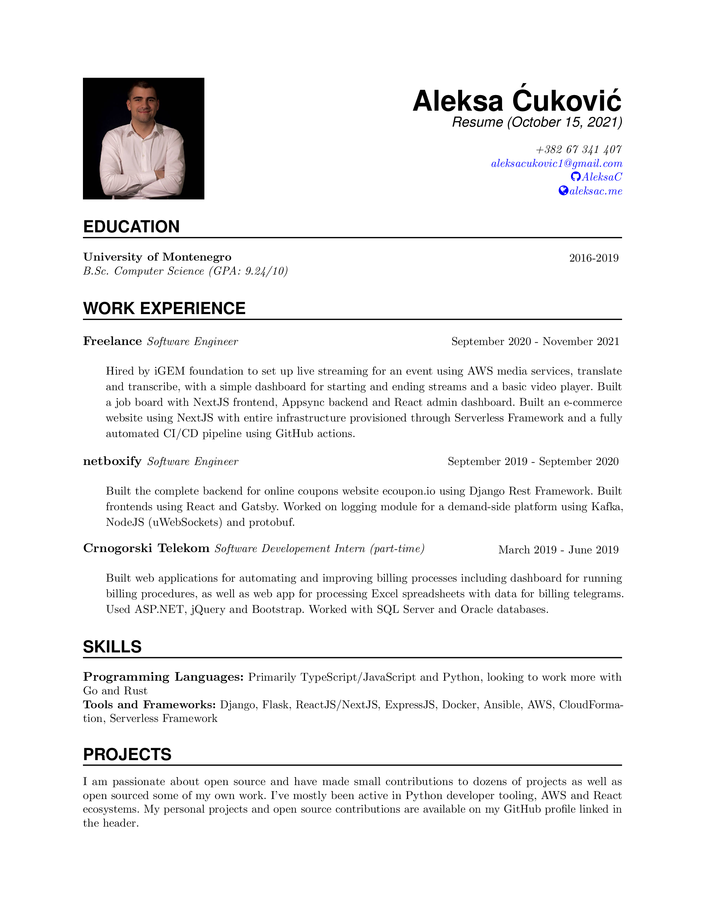

# Resume
[](https://github.com/AleksaC/resume/blob/master/LICENSE)
[](https://travis-ci.org/AleksaC/resume)

This repository contains the latest version of my resume. It's a single-page
one-column resume made in LaTeX.
While I only have basic knowledge of LaTeX I found it to be much better than
the alternatives both in terms of looks and maintainability.

The layout is based on a template I found on Overleaf, but I don't remember
which one was it and I was unable to find it again, therefore I cannot
reference it.

## Generating pdf and png previews 📄
I used `pdflatex` to generate pdf version of the resume. To install it along
with some extras run the following command:

```commandline
sudo apt-get install texlive texlive-latex-extra texlive-fonts-extra
```

To generate a pdf file as well as png preview you can simply run `make`. To get
rid of the auxiliary and log files generated by pdflatex run `make clean`. If
you don't want a png preview you can simply run `make resume.pdf` or
`pdflatex resume.tex` to get only pdf. I used `convert` for creating a png
preview based on generated pdf. To create the preview of the resume you will
likely need to modify `/etc/ImageMagick-6/policy.xml` to allow it to work with
pdf files. I've created `change_policy.py` to take care of that. To use it you
first need to install `lxml`. While your system may already have it installed I
recommend running `python -m pip install lxml` to make sure that it's installed
for the version of python you're using. To run the script you will also likely
have to either change the permissions for `policy.xml` by
running `sudo chmod a+w /etc/ImageMagick-6/policy.xml` or run the script as
superuser. Note that running `sudo python change_policy.py` may not run a
the expected version of python interpreter. Even after changing the policy `convert`
may still fail. In my case the problem was that ghostscript wasn't installed,
but that's easily fixed by running `sudo apt-get install ghostscript`.

**Note:** Scripts in this repo were created and tested on Linux. You probably
cannot use them on Windows, but they'll likely work on MacOS with slight
modifications.

## Using Travis-CI 👷 to automatically update previews
Since updates to this repository are mostly small updates to resume.tex, it is
often easier to just make them using the GitHub editor, without the overhead of
making modifications locally and then pushing them to GitHub. For that reason
I've configured Travis-CI to run build which automatically generates pdf file
as well as preview image and push them back to this repository. This way I don't
have to worry if the previews are up to date with the contents of the tex file.

To push to GitHub from Travis you need to obtain a personal access token by
going to Github *Settings > Developer settings > Personal access tokens* where
you can generate a new token. After copying the token go to the settings of
your repo on Travis-CI (under *More options*) and add `GH_TOKEN` environment
variable with the value being the token you just copied.

## Preview


